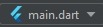
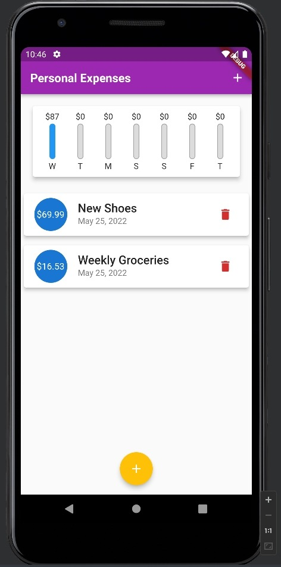
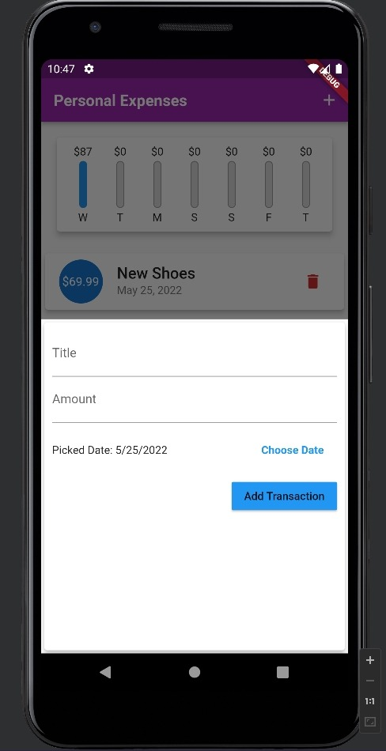
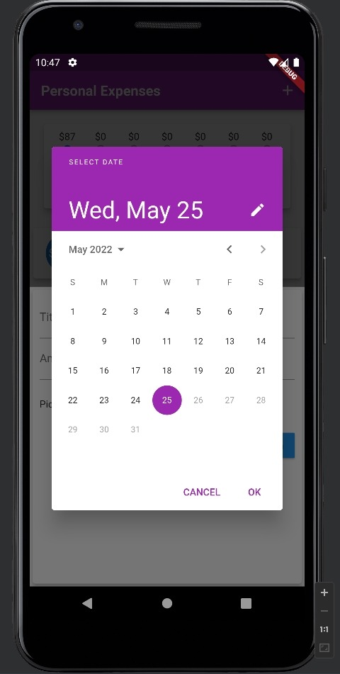

# PersonalExpensesFlutterApp

 An example mobile application to showcase several styling, adaptive and responsive concepts in Flutter

## How to run?

Firstly, you have to have Flutter installed. Flutter can be installed through Flutter's official platform: [Install | Flutter](https://docs.flutter.dev/get-started/install?gclid=CjwKCAjwp7eUBhBeEiwAZbHwkQy5-a43EsgM6SboS6GWyD1tOVQnn4KL-TLVmn5IZiV60RGrGdQI1RoConoQAvD_BwE&gclsrc=aw.ds)

Now, that you have installed Flutter and ran `flutter doctor`, make sure you have the following:

- Flutter SDK

- Android Studio
  
  - Be sure to accept all licenses before proceeding

- A phone emulator (Can be created via Android Studio if not already by following this tutorial: [Create & Manage AVDs](https://developer.android.com/studio/run/managing-avds))

Now that you're ready to run Flutter apps, clone this repo, and open its contents in Android Studio.

Start your emulator, then run the project from main.dart

**Note:** Please make sure you have the Flutter plugin in Android Studio, and that the project is running as a Flutter project, not a dart file. You should know that your project is ready to debug when you see this icon in your run configuration dropdown menu



If you see this icon  , then you have to edit your running configuration or install Flutter plugin.

**Note:** This project runs a *no sound null safety* Flutter package `intl`, therefore it might fail to debug. If that happens, try to run it using 

```
flutter run --no-sound-null-safety
```

## Project Lessons

This project is supposed to showcase the following concepts in Flutter:

* Splitting the project into Model, Widgets and assets

* Showcasing the differences between several layout widgets (***Column, Row, Container***)

* Showcasing  the concepts of Themes and Styling options (***TextStyles, ThemeData, custom Fonts, etc***)

* Using and manipulating ***DateTime*** objects (Using dates)

* Fetching User Input

* Mapping a list of objects to a ***ListView***

* Creating a ***Modal Bottom Sheet***

* Creating and utilizing Flutter's ***DatePicker***

*	Using ***LayoutBuilder*** to know size constraints

*	Using textScaleFactor

*	Coding with different screen orientations

*	Coding for different platforms (Android, iOS)


## Screenshots from the app




